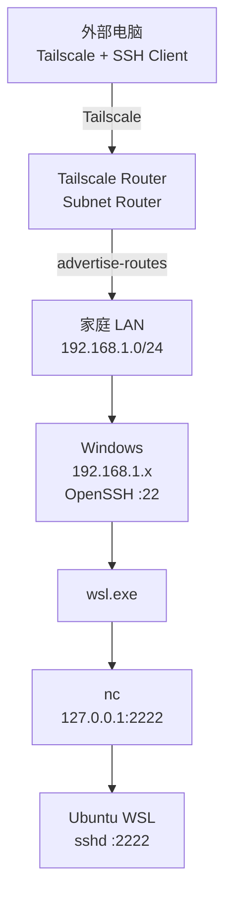

# Tailscale + Windows + WSL 外网 SSH 访问流程

## 1. 网络结构

假设家庭 LAN 为：

```text
192.168.1.0/24
```

典型地址分配：

```text
192.168.1.0      网络地址
192.168.1.1      默认网关，通常是光猫或主路由器
192.168.1.x      Windows、AP、NAS 等局域网设备
192.168.1.255    广播地址
```

如果安装 Tailscale 的设备工作在 AP 模式，它本身只是局域网中的一台设备，例如：

```text
光猫 / 主路由
192.168.1.1
      │
      ├── AP / Tailscale Router
      │      192.168.1.2
      │
      └── Windows
             192.168.1.10
```

最终远程访问链路：


---

## 2. 路由器准备

准备一台能够运行 Tailscale 的路由器或网络设备。常见方式包括：

```text
原生支持 Tailscale 的路由器
OpenWrt
Asuswrt-Merlin + Tailscale 安装方案
其他能够运行 Tailscale 的 Linux 路由系统
```

如果当前路由器原厂固件不能运行 Tailscale，可以根据设备支持情况刷入 OpenWrt、Asuswrt-Merlin 或其他兼容固件。刷第三方固件时，应使用与设备型号完全对应的固件文件，并按照该固件项目针对该设备提供的升级方式操作。升级完成并确认运行正常后再插回移动硬盘。如果设备工作在 AP 模式，只要它能够正常访问局域网和互联网，也可以承担 Tailscale subnet router 的功能。

---

## 3. 在路由器运行 Tailscale

注册 Tailscale 账号，然后让路由器加入自己的 tailnet。路由器需要发布家庭 LAN：

```bash
tailscale up --advertise-routes=192.168.1.0/24
```

随后在 Tailscale 管理页面批准：

```text
192.168.1.0/24
```

这条 subnet route。

完成以后：

```text
外部 Tailscale 客户端
        │
        ▼
Tailscale 网络
        │
        ▼
Tailscale Router
        │
        ▼
192.168.1.0/24
```

外部机器就可以直接访问类似：

```text
192.168.1.10
192.168.1.20
192.168.1.100
```

这样的家庭 LAN 地址。外部使用的电脑也安装 Tailscale，并加入同一个 tailnet。

---

## 4. Windows 准备 OpenSSH

Windows 安装并启动 OpenSSH Server。确认：

```powershell
Get-Service sshd
```

需要自动启动的话：

```powershell
Set-Service sshd -StartupType Automatic
Start-Service sshd
```

把客户端 SSH 公钥加入 Windows。普通用户：

```text
C:\Users\<Windows用户名>\.ssh\authorized_keys
```

管理员账户可能使用：

```text
C:\ProgramData\ssh\administrators_authorized_keys
```

私钥保留在外部客户端。

---

## 5. 设置 Windows 网络为 Private

更换光猫、主路由器或局域网结构后，Windows 可能把网络重新识别成：

```text
Public
```

查看：

```powershell
Get-NetConnectionProfile
```

改为：

```powershell
Set-NetConnectionProfile `
  -InterfaceAlias "Ethernet" `
  -NetworkCategory Private
```

确认结果：

```powershell
Get-NetConnectionProfile
```

应显示：

```text
NetworkCategory : Private
```

---

## 6. Windows 防火墙

允许 Windows OpenSSH 的 TCP 22 入站。查看 OpenSSH 规则：

```powershell
Get-NetFirewallRule |
Where-Object DisplayName -Match "OpenSSH"
```

如果需要允许局域网设备 ping Windows，可以单独添加 ICMPv4 Echo Request：

```powershell
New-NetFirewallRule `
  -DisplayName "Allow ICMPv4 Echo Request" `
  -Protocol ICMPv4 `
  -IcmpType 8 `
  -Direction Inbound `
  -Action Allow `
  -Profile Private
```

这条规则允许：

```text
Private Profile
+
Inbound
+
ICMPv4
+
Echo Request
```

也就是允许别人 ping 这台 Windows。还可以限制来源为家庭 LAN：

```powershell
Set-NetFirewallRule `
  -DisplayName "Allow ICMPv4 Echo Request" `
  -RemoteAddress 192.168.1.0/24
```

---

## 7. WSL 配置 SSH Server

WSL 内安装 OpenSSH Server，例如 Ubuntu：

```bash
sudo apt install openssh-server
```

编辑：

```text
/etc/ssh/sshd_config
```

设置：

```text
Port 2222
ListenAddress 127.0.0.1
```

然后启动 sshd。如果使用 systemd：

```bash
sudo systemctl enable ssh
sudo systemctl start ssh
```

把客户端公钥加入：

```text
~/.ssh/authorized_keys
```

WSL SSH 监听：

```text
127.0.0.1:2222
```

这样 WSL 的 SSH 入口只在 WSL 内部 loopback 上监听。

---

## 8. WSL 安装 nc

安装 netcat：

```bash
sudo apt install netcat-openbsd
```

确认：

```bash
which nc
```

通常得到：

```text
/usr/bin/nc
```

后续 Windows SSH session 会执行：

```text
wsl.exe
    ↓
/usr/bin/nc
    ↓
127.0.0.1:2222
```

---

## 9. 外部电脑 SSH 配置

客户端 `~/.ssh/config`：

```sshconfig
Host windows
    HostName 192.168.1.10
    User WINDOWS_USER
    IdentityFile "/path/to/private/key"
    IdentitiesOnly yes

Host wsl
    HostName 127.0.0.1
    Port 2222
    User WSL_USER
    IdentityFile "/path/to/private/key"
    IdentitiesOnly yes
    ProxyCommand ssh -T windows "wsl.exe -d Ubuntu-24.04 --exec /usr/bin/nc 127.0.0.1 2222"
```

其中：

```text
192.168.1.10
```

替换成 Windows 的实际 LAN IP。

```text
WINDOWS_USER
```

替换成 Windows 用户名。

```text
WSL_USER
```

替换成 WSL 用户名。

```text
Ubuntu-24.04
```

替换成：

```bash
wsl -l -v
```

显示的实际发行版名称。

---

## 10. SSH 到 Windows

外部电脑加入 Tailscale 后：

```bash
ssh windows
```

链路：

```text
外部电脑
   │
   │ Tailscale
   ▼
Tailscale Router
   │
   │ 192.168.1.0/24
   ▼
Windows :22
```

---

## 11. SSH 到 WSL

执行：

```bash
ssh wsl
```

实际执行过程：

```mermaid
flowchart LR
    A[SSH Client] --> B[Windows sshd :22]
    B --> C[wsl.exe -d Ubuntu-24.04]
    C --> D[/usr/bin/nc]
    D --> E[127.0.0.1:2222]
    E --> F[WSL sshd]
```

`ProxyCommand` 会先 SSH 到 Windows，然后在 Windows SSH session 中执行：

```text
wsl.exe -d Ubuntu-24.04 --exec /usr/bin/nc 127.0.0.1 2222
```

`nc` 把 SSH 字节流转发给 WSL 内部的：

```text
127.0.0.1:2222
```

最终 SSH Client 和 WSL sshd 完成第二层 SSH 协议通信。

---

## 12. WSL NVIDIA / CUDA PATH

如果 SSH 进入 WSL 后需要直接找到 WSL 提供的 NVIDIA/CUDA 相关库，可以在：

```text
${HOME}/.profile
```

加入：

```bash
if [ -d /usr/lib/wsl/lib ]; then
    case ":$PATH:" in
        *:/usr/lib/wsl/lib:*) ;;
        *) PATH="/usr/lib/wsl/lib:$PATH" ;;
    esac
fi
```

重新登录后生效。确认：

```bash
echo "$PATH"
```

应该包含：

```text
/usr/lib/wsl/lib
```

---

# 最终结构



最终使用：

```bash
ssh windows
```
进入 Windows。

```bash
ssh wsl
```
直接进入 WSL。
