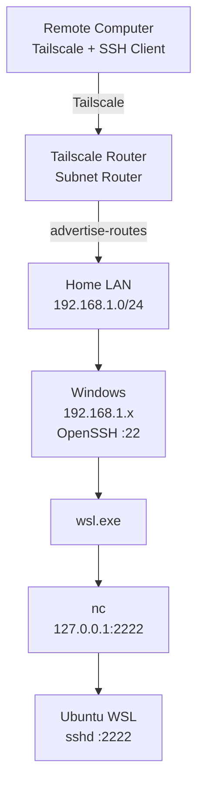

# Tailscale + Windows + WSL Remote SSH Access Workflow

## 1. Network Structure

Assume the home LAN is:

```text
192.168.1.0/24
```

A typical address layout is:

```text
192.168.1.0      Network address
192.168.1.1      Default gateway, usually the ONT/modem-router or main router
192.168.1.x      LAN devices such as Windows hosts, APs, and NAS devices
192.168.1.255    Broadcast address
```

If the device running Tailscale operates in AP mode, it is simply another device on the LAN. For example:

```text
ONT / Main Router
192.168.1.1
      │
      ├── AP / Tailscale Router
      │      192.168.1.2
      │
      └── Windows
             192.168.1.10
```

The final remote access path is:


---

## 2. Prepare the Router

Prepare a router or network device capable of running Tailscale. Common options include:

```text
Routers with native Tailscale support
OpenWrt
Asuswrt-Merlin + a Tailscale installation method
Other Linux-based router systems capable of running Tailscale
```

If the router's stock firmware cannot run Tailscale, install OpenWrt, Asuswrt-Merlin, or another compatible firmware supported by the device.

When installing third-party firmware, use firmware that exactly matches the router model and follow the installation procedure provided by that firmware project for the device.

If the device operates in AP mode, it can still serve as a Tailscale subnet router as long as it can access both the LAN and the Internet normally.

---

## 3. Run Tailscale on the Router

Create a Tailscale account and add the router to your tailnet.

The router needs to advertise the home LAN:

```bash
tailscale up --advertise-routes=192.168.1.0/24
```

Then approve the following subnet route in the Tailscale administration interface:

```text
192.168.1.0/24
```

After configuration:

```text
Remote Tailscale Client
        │
        ▼
Tailscale Network
        │
        ▼
Tailscale Router
        │
        ▼
192.168.1.0/24
```

The remote machine can then directly access home LAN addresses such as:

```text
192.168.1.10
192.168.1.20
192.168.1.100
```

Install Tailscale on the remote computer as well and join it to the same tailnet.

---

## 4. Prepare OpenSSH on Windows

Install and start OpenSSH Server on Windows.

Check the service:

```powershell
Get-Service sshd
```

To configure it to start automatically:

```powershell
Set-Service sshd -StartupType Automatic
Start-Service sshd
```

Add the SSH client's public key to Windows.

For a regular user:

```text
C:\Users\<WindowsUsername>\.ssh\authorized_keys
```

For an administrator account, the key may be stored in:

```text
C:\ProgramData\ssh\administrators_authorized_keys
```

Keep the private key on the remote client.

---

## 5. Set the Windows Network Profile to Private

After replacing the ONT/modem-router, main router, or changing the LAN structure, Windows may detect the network as:

```text
Public
```

Check the current profile:

```powershell
Get-NetConnectionProfile
```

Change it to Private:

```powershell
Set-NetConnectionProfile `
  -InterfaceAlias "Ethernet" `
  -NetworkCategory Private
```

Verify the result:

```powershell
Get-NetConnectionProfile
```

It should show:

```text
NetworkCategory : Private
```

---

## 6. Windows Firewall

Allow inbound TCP port 22 for Windows OpenSSH.

Check the OpenSSH firewall rules:

```powershell
Get-NetFirewallRule |
Where-Object DisplayName -Match "OpenSSH"
```

If LAN devices also need to ping the Windows host, add a dedicated ICMPv4 Echo Request rule:

```powershell
New-NetFirewallRule `
  -DisplayName "Allow ICMPv4 Echo Request" `
  -Protocol ICMPv4 `
  -IcmpType 8 `
  -Direction Inbound `
  -Action Allow `
  -Profile Private
```

This rule allows:

```text
Private Profile
+
Inbound
+
ICMPv4
+
Echo Request
```

This allows other devices to ping the Windows host.

The source can also be restricted to the home LAN:

```powershell
Set-NetFirewallRule `
  -DisplayName "Allow ICMPv4 Echo Request" `
  -RemoteAddress 192.168.1.0/24
```

---

## 7. Configure the SSH Server in WSL

Install OpenSSH Server inside WSL. For Ubuntu:

```bash
sudo apt install openssh-server
```

Edit:

```text
/etc/ssh/sshd_config
```

Configure:

```text
Port 2222
ListenAddress 127.0.0.1
```

Then start `sshd`.

If systemd is enabled:

```bash
sudo systemctl enable ssh
sudo systemctl start ssh
```

Add the client's public key to:

```text
~/.ssh/authorized_keys
```

The WSL SSH server listens on:

```text
127.0.0.1:2222
```

The WSL SSH endpoint is therefore available only through the WSL loopback interface.

---

## 8. Install nc in WSL

Install netcat:

```bash
sudo apt install netcat-openbsd
```

Verify the executable path:

```bash
which nc
```

The result is normally:

```text
/usr/bin/nc
```

The Windows SSH session will later execute:

```text
wsl.exe
    ↓
/usr/bin/nc
    ↓
127.0.0.1:2222
```

---

## 9. Configure SSH on the Remote Computer

Configure the client's `~/.ssh/config`:

```sshconfig
Host windows
    HostName 192.168.1.10
    User WINDOWS_USER
    IdentityFile "/path/to/private/key"
    IdentitiesOnly yes

Host wsl
    HostName 127.0.0.1
    Port 2222
    User WSL_USER
    IdentityFile "/path/to/private/key"
    IdentitiesOnly yes
    ProxyCommand ssh -T windows "wsl.exe -d Ubuntu-24.04 --exec /usr/bin/nc 127.0.0.1 2222"
```

Replace:

```text
192.168.1.10
```

with the actual LAN IP address of the Windows host.

Replace:

```text
WINDOWS_USER
```

with the Windows username.

Replace:

```text
WSL_USER
```

with the WSL username.

Replace:

```text
Ubuntu-24.04
```

with the actual distribution name shown by:

```bash
wsl -l -v
```

---

## 10. SSH into Windows

After the remote computer joins the tailnet:

```bash
ssh windows
```

The connection path is:

```text
Remote Computer
   │
   │ Tailscale
   ▼
Tailscale Router
   │
   │ 192.168.1.0/24
   ▼
Windows :22
```

---

## 11. SSH into WSL

Run:

```bash
ssh wsl
```

The actual connection process is:

```mermaid
flowchart LR
    A[SSH Client] --> B[Windows sshd :22]
    B --> C[wsl.exe -d Ubuntu-24.04]
    C --> D[/usr/bin/nc]
    D --> E[127.0.0.1:2222]
    E --> F[WSL sshd]
```

`ProxyCommand` first establishes an SSH connection to Windows and then executes the following command inside the Windows SSH session:

```text
wsl.exe -d Ubuntu-24.04 --exec /usr/bin/nc 127.0.0.1 2222
```

`nc` forwards the SSH byte stream to:

```text
127.0.0.1:2222
```

inside WSL.

The SSH client then completes the second SSH connection directly with the WSL `sshd`.

---

## 12. WSL NVIDIA / CUDA PATH

If the WSL-provided NVIDIA/CUDA libraries need to be available after logging in through SSH, add the following to:

```text
${HOME}/.profile
```

```bash
if [ -d /usr/lib/wsl/lib ]; then
    case ":$PATH:" in
        *:/usr/lib/wsl/lib:*) ;;
        *) PATH="/usr/lib/wsl/lib:$PATH" ;;
    esac
fi
```

Log in again for the change to take effect.

Verify with:

```bash
echo "$PATH"
```

The output should contain:

```text
/usr/lib/wsl/lib
```

---

# Final Structure



Usage:

```bash
ssh windows
```

Connects to Windows.

```bash
ssh wsl
```

Connects directly to WSL.
