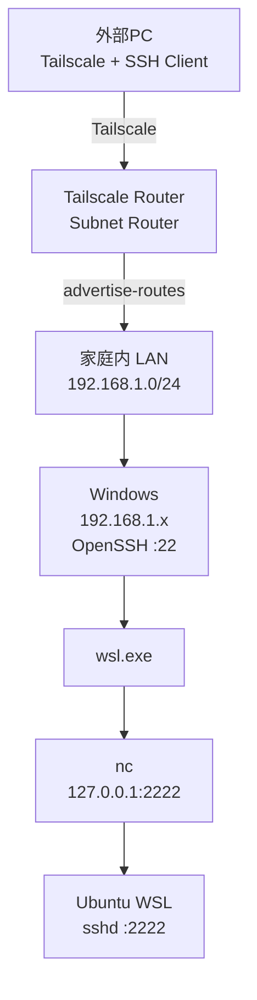

# Tailscale + Windows + WSL 外部ネットワークからの SSH アクセス手順

## 1. ネットワーク構成

家庭内 LAN を次のように想定する。

```text
192.168.1.0/24
```

典型的なアドレス構成は次のとおり。

```text
192.168.1.0      ネットワークアドレス
192.168.1.1      デフォルトゲートウェイ。通常は ONU・ホームゲートウェイまたはメインルーター
192.168.1.x      Windows、AP、NAS などの LAN 内デバイス
192.168.1.255    ブロードキャストアドレス
```

Tailscale を実行するデバイスが AP モードで動作している場合、そのデバイスも LAN 内の一台の機器として配置される。

例：

```text
ONU / メインルーター
192.168.1.1
      │
      ├── AP / Tailscale Router
      │      192.168.1.2
      │
      └── Windows
             192.168.1.10
```

最終的なリモートアクセス経路は次のようになる。


---

## 2. ルーターの準備

Tailscale を実行できるルーターまたはネットワークデバイスを用意する。

代表的な構成は次のとおり。

```text
Tailscale を標準サポートするルーター
OpenWrt
Asuswrt-Merlin + Tailscale の導入環境
Tailscale を実行できるその他の Linux ベースのルーターシステム
```

現在の純正ファームウェアで Tailscale を実行できない場合は、その機種が対応している OpenWrt、Asuswrt-Merlin、またはその他の互換ファームウェアを導入する。

サードパーティ製ファームウェアを導入する場合は、対象機種と完全に一致するファームウェアを使用し、そのプロジェクトが機種ごとに指定している手順に従う。

AP モードで動作しているデバイスでも、LAN とインターネットの双方へ正常に通信できれば、Tailscale subnet router として利用できる。

---

## 3. ルーターで Tailscale を実行する

Tailscale のアカウントを作成し、ルーターを自分の tailnet に参加させる。

ルーターから家庭内 LAN を広告する。

```bash
tailscale up --advertise-routes=192.168.1.0/24
```

その後、Tailscale の管理画面で次の subnet route を承認する。

```text
192.168.1.0/24
```

設定後の経路は次のようになる。

```text
外部 Tailscale クライアント
        │
        ▼
Tailscale ネットワーク
        │
        ▼
Tailscale Router
        │
        ▼
192.168.1.0/24
```

外部の端末から、次のような家庭内 LAN のアドレスへ直接アクセスできる。

```text
192.168.1.10
192.168.1.20
192.168.1.100
```

外部から使用する PC にも Tailscale をインストールし、同じ tailnet に参加させる。

---

## 4. Windows に OpenSSH を準備する

Windows に OpenSSH Server をインストールして起動する。

状態を確認する。

```powershell
Get-Service sshd
```

自動起動を有効にする場合：

```powershell
Set-Service sshd -StartupType Automatic
Start-Service sshd
```

SSH クライアント側の公開鍵を Windows に登録する。

一般ユーザーの場合：

```text
C:\Users\<Windowsユーザー名>\.ssh\authorized_keys
```

管理者アカウントでは、次のファイルが使用される場合がある。

```text
C:\ProgramData\ssh\administrators_authorized_keys
```

秘密鍵は外部クライアント側に保持する。

---

## 5. Windows のネットワークプロファイルを Private に設定する

ONU・ホームゲートウェイ、メインルーター、LAN 構成などを変更すると、Windows がネットワークを次のように再認識することがある。

```text
Public
```

現在の設定を確認する。

```powershell
Get-NetConnectionProfile
```

Private に変更する。

```powershell
Set-NetConnectionProfile `
  -InterfaceAlias "Ethernet" `
  -NetworkCategory Private
```

変更結果を確認する。

```powershell
Get-NetConnectionProfile
```

次のように表示されればよい。

```text
NetworkCategory : Private
```

---

## 6. Windows ファイアウォール

Windows OpenSSH が使用する TCP 22 の受信通信を許可する。

OpenSSH のファイアウォールルールを確認する。

```powershell
Get-NetFirewallRule |
Where-Object DisplayName -Match "OpenSSH"
```

LAN 内の機器から Windows への ping も許可する場合は、ICMPv4 Echo Request 用のルールを追加する。

```powershell
New-NetFirewallRule `
  -DisplayName "Allow ICMPv4 Echo Request" `
  -Protocol ICMPv4 `
  -IcmpType 8 `
  -Direction Inbound `
  -Action Allow `
  -Profile Private
```

このルールが許可する条件は次のとおり。

```text
Private Profile
+
Inbound
+
ICMPv4
+
Echo Request
```

これにより、他の機器から Windows へ ping を送信できる。

送信元を家庭内 LAN のみに制限する場合：

```powershell
Set-NetFirewallRule `
  -DisplayName "Allow ICMPv4 Echo Request" `
  -RemoteAddress 192.168.1.0/24
```

---

## 7. WSL に SSH Server を設定する

WSL 内に OpenSSH Server をインストールする。

Ubuntu の場合：

```bash
sudo apt install openssh-server
```

次のファイルを編集する。

```text
/etc/ssh/sshd_config
```

以下を設定する。

```text
Port 2222
ListenAddress 127.0.0.1
```

その後 `sshd` を起動する。

systemd を使用している場合：

```bash
sudo systemctl enable ssh
sudo systemctl start ssh
```

クライアントの公開鍵を次のファイルに登録する。

```text
~/.ssh/authorized_keys
```

WSL の SSH Server は次のアドレスで待ち受ける。

```text
127.0.0.1:2222
```

これにより、WSL の SSH エンドポイントは WSL 内部の loopback インターフェースだけで待ち受ける。

---

## 8. WSL に nc をインストールする

netcat をインストールする。

```bash
sudo apt install netcat-openbsd
```

パスを確認する。

```bash
which nc
```

通常は次のようになる。

```text
/usr/bin/nc
```

後ほど Windows の SSH セッションから次の経路で実行される。

```text
wsl.exe
    ↓
/usr/bin/nc
    ↓
127.0.0.1:2222
```

---

## 9. 外部 PC の SSH 設定

クライアント側の `~/.ssh/config` を設定する。

```sshconfig
Host windows
    HostName 192.168.1.10
    User WINDOWS_USER
    IdentityFile "/path/to/private/key"
    IdentitiesOnly yes

Host wsl
    HostName 127.0.0.1
    Port 2222
    User WSL_USER
    IdentityFile "/path/to/private/key"
    IdentitiesOnly yes
    ProxyCommand ssh -T windows "wsl.exe -d Ubuntu-24.04 --exec /usr/bin/nc 127.0.0.1 2222"
```

次の部分：

```text
192.168.1.10
```

を Windows の実際の LAN IP アドレスに置き換える。

```text
WINDOWS_USER
```

を Windows のユーザー名に置き換える。

```text
WSL_USER
```

を WSL のユーザー名に置き換える。

```text
Ubuntu-24.04
```

を次のコマンドで表示される実際のディストリビューション名に置き換える。

```bash
wsl -l -v
```

---

## 10. Windows へ SSH 接続する

外部 PC を tailnet に参加させた後、次のコマンドを実行する。

```bash
ssh windows
```

接続経路：

```text
外部PC
   │
   │ Tailscale
   ▼
Tailscale Router
   │
   │ 192.168.1.0/24
   ▼
Windows :22
```

---

## 11. WSL へ SSH 接続する

次のコマンドを実行する。

```bash
ssh wsl
```

実際の接続処理は次のようになる。

```mermaid
flowchart LR
    A[SSH Client] --> B[Windows sshd :22]
    B --> C[wsl.exe -d Ubuntu-24.04]
    C --> D[/usr/bin/nc]
    D --> E[127.0.0.1:2222]
    E --> F[WSL sshd]
```

`ProxyCommand` は最初に Windows へ SSH 接続し、その Windows SSH セッション内で次のコマンドを実行する。

```text
wsl.exe -d Ubuntu-24.04 --exec /usr/bin/nc 127.0.0.1 2222
```

`nc` は SSH のバイトストリームを WSL 内部の次のアドレスへ転送する。

```text
127.0.0.1:2222
```

その後、SSH Client と WSL の `sshd` が第2段階の SSH 通信を行う。

---

## 12. WSL NVIDIA / CUDA PATH

SSH 経由で WSL にログインした際にも、WSL が提供する NVIDIA/CUDA 関連ライブラリを参照できるようにする場合は、次のファイル：

```text
${HOME}/.profile
```

に以下を追加する。

```bash
if [ -d /usr/lib/wsl/lib ]; then
    case ":$PATH:" in
        *:/usr/lib/wsl/lib:*) ;;
        *) PATH="/usr/lib/wsl/lib:$PATH" ;;
    esac
fi
```

再ログイン後に反映される。

確認：

```bash
echo "$PATH"
```

次のパスが含まれていればよい。

```text
/usr/lib/wsl/lib
```

---

# 最終構成



最終的な使用方法：

```bash
ssh windows
```

Windows に接続する。

```bash
ssh wsl
```

WSL に直接接続する。
