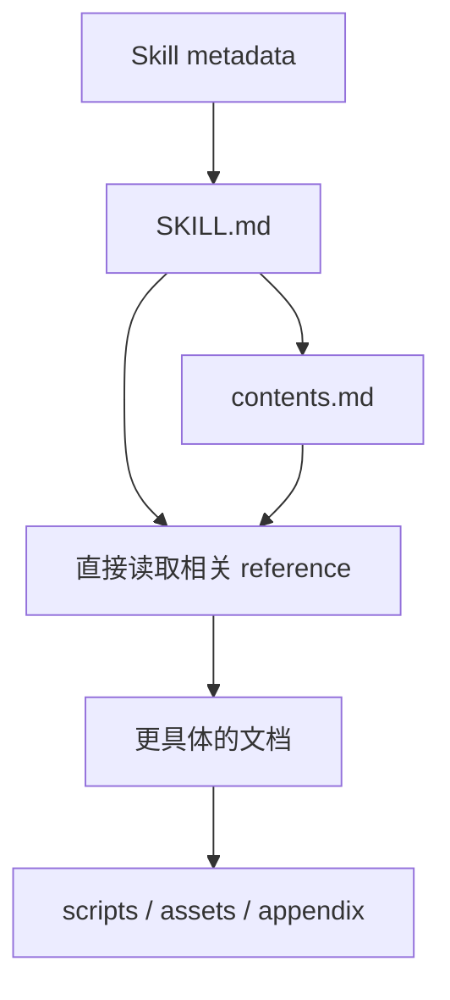

# Domain Skill 配置方案

Domain Skill 以领域作为 Skill 单位，通过一个 `SKILL.md` 作为入口，领域内部使用普通文档结构组织具体能力和参考资料。

## 1. 基本结构

```text
.agents/skills/
└── domain-skill/
    ├── SKILL.md
    ├── contents.md
    ├── references/
    ├── scripts/
    └── assets/
```

其中只有 `SKILL.md` 是 Skill 入口。

其他文件和目录根据实际内容使用，不要求全部存在。

---

## 2. `SKILL.md`

`SKILL.md` 保存领域级信息：

- Skill 名称与描述；
- 领域用途；
- 核心规则；
- 常见任务的导航；
- 相关 reference 的读取指引。

例如：

```markdown
---
name: software-engineering
description: Software engineering workflows covering analysis, implementation, testing, debugging, and review.
---

# Software Engineering

## Routing

- Code analysis → `references/code-analysis.md`
- Implementation → `references/implementation.md`
- Testing → `references/testing.md`
- Debugging → `references/debugging.md`
- Code review → `references/code-review.md`

For the complete documentation map, read `contents.md`.

## Core Rules

- Inspect existing code before modifying it.
- Preserve project conventions.
- Verify changes using available tools.
```

`SKILL.md` 可以直接指向具体 reference，也可以通过 `contents.md` 提供完整导航。

---

## 3. `references/`

`references/` 保存领域内部的具体能力、工作流、规则和知识材料。

目录结构根据内容规模自然展开。

### 薄型 Domain Skill

内容较少时直接平铺：

```text
domain-skill/
├── SKILL.md
└── references/
    ├── search.md
    ├── verify.md
    └── merge.md
```

`SKILL.md` 直接导航：

```markdown
## Routing

- Search → `references/search.md`
- Verification → `references/verify.md`
- Merge → `references/merge.md`
```

### 中型 Domain Skill

内容增加后，可以加入 `contents.md`：

```text
domain-skill/
├── SKILL.md
├── contents.md
└── references/
    ├── search.md
    ├── verification.md
    ├── merge.md
    ├── validation.md
    └── examples.md
```

### 大型 Domain Skill

某个部分继续增长时，再使用子目录：

```text
domain-skill/
├── SKILL.md
├── contents.md
└── references/
    ├── search/
    │   ├── index.md
    │   ├── query-planning.md
    │   └── source-selection.md
    ├── verification/
    │   ├── index.md
    │   ├── source-check.md
    │   └── conflict-resolution.md
    ├── merge/
    │   ├── index.md
    │   └── deduplication.md
    └── appendix/
        ├── glossary.md
        ├── examples.md
        └── edge-cases.md
```

---

## 4. `contents.md`

`contents.md` 用于内容较多时提供完整目录。

例如：

```markdown
# Contents

## Search

- [Overview](references/search/index.md)
- [Query Planning](references/search/query-planning.md)
- [Source Selection](references/search/source-selection.md)

## Verification

- [Overview](references/verification/index.md)
- [Source Check](references/verification/source-check.md)
- [Conflict Resolution](references/verification/conflict-resolution.md)

## Merge

- [Overview](references/merge/index.md)
- [Deduplication](references/merge/deduplication.md)

## Appendix

- [Glossary](references/appendix/glossary.md)
- [Examples](references/appendix/examples.md)
- [Edge Cases](references/appendix/edge-cases.md)
```

`contents.md` 只在领域内容需要完整索引时加入。

---

## 5. `scripts/`

`scripts/` 保存 Skill 使用的辅助程序：

```text
scripts/
├── validate.py
├── collect_context.py
└── check_output.py
```

对应 reference 可以直接说明什么时候调用这些脚本。

---

## 6. `assets/`

`assets/` 保存静态资源：

```text
assets/
├── templates/
├── schemas/
└── examples/
```

包括模板、schema、样例文件以及其他工作材料。

---

## 7. 渐进展开

Domain Skill 的基本加载关系：



薄型 Skill 可以直接：

```text
SKILL.md
    ↓
references/task.md
```

中大型 Skill 可以：

```text
SKILL.md
    ↓
contents.md
    ↓
references/<section>/
    ↓
具体文档
```

---

## 8. 组织原则

Domain Skill 的结构按实际内容复杂度增长：

```text
简单
SKILL.md
└── references/*.md
```

```text
中等
SKILL.md
├── contents.md
└── references/*.md
```

```text
复杂
SKILL.md
├── contents.md
└── references/
    ├── section-a/
    ├── section-b/
    └── appendix/
```

整体关系为：

```text
Domain Skill
    ↓
SKILL.md
    ↓
contents.md / direct routing
    ↓
references/
    ↓
具体知识与工作流
```

核心原则：

> 领域作为 Skill 的发现单位，领域内部按照实际内容规模使用普通文档结构逐步展开。
