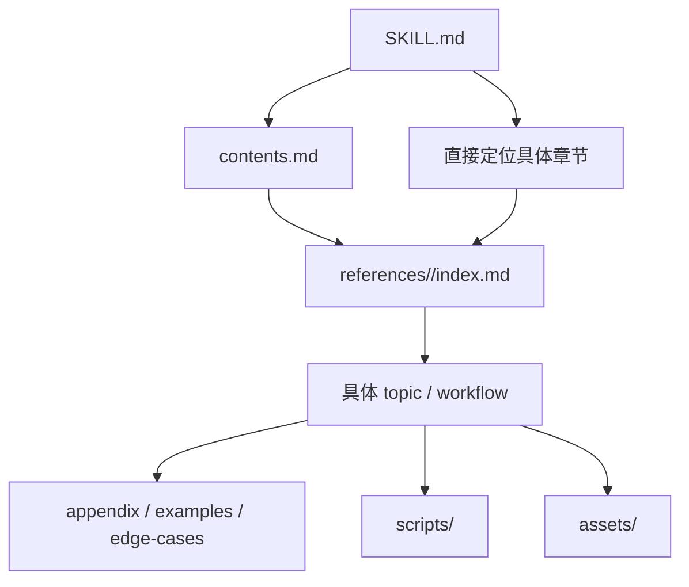

# Domain Skill 配置方案

以领域作为 Skill 单位，领域内部按照普通技术文档的组织方式分层展开。

## 1. 目录结构

```text
.agents/skills/
└── domain-skill/
    ├── SKILL.md
    ├── contents.md
    ├── references/
    │   ├── chapter-a/
    │   │   ├── index.md
    │   │   ├── topic-a.md
    │   │   └── topic-b.md
    │   ├── chapter-b/
    │   │   ├── index.md
    │   │   └── topic-a.md
    │   └── appendix/
    │       ├── glossary.md
    │       ├── examples.md
    │       └── edge-cases.md
    ├── scripts/
    └── assets/
```

## 2. `SKILL.md`

`SKILL.md` 作为整个领域的入口，保存：

- 领域用途；
- 适用任务；
- 领域级核心规则；
- 常用任务到具体章节的路由；
- `contents.md` 的入口。

例如：

```markdown
---
name: software-engineering
description: Software engineering workflows covering analysis, implementation, testing, debugging, and review.
---

# Software Engineering

## Routing

- Code analysis → `references/code-analysis/index.md`
- Implementation → `references/implementation/index.md`
- Testing → `references/testing/index.md`
- Debugging → `references/debugging/index.md`
- Code review → `references/code-review/index.md`

For the complete documentation map, read `contents.md`.

## Core Rules

- Inspect existing code before modifying it.
- Preserve project conventions.
- Verify changes using available tools.
- Keep tests focused on observable production behavior.
```

## 3. `contents.md`

`contents.md` 保存领域内部的完整目录索引。

```markdown
# Contents

## Code Analysis

- [Overview](references/code-analysis/index.md)
- [Architecture](references/code-analysis/architecture.md)
- [Dependency Tracing](references/code-analysis/dependency-tracing.md)

## Implementation

- [Overview](references/implementation/index.md)
- [Feature Implementation](references/implementation/feature.md)
- [Refactoring](references/implementation/refactoring.md)

## Testing

- [Overview](references/testing/index.md)
- [Unit Testing](references/testing/unit-testing.md)
- [Integration Testing](references/testing/integration-testing.md)
- [System Testing](references/testing/system-testing.md)

## Debugging

- [Overview](references/debugging/index.md)
- [Failure Localization](references/debugging/failure-localization.md)

## Appendix

- [Glossary](references/appendix/glossary.md)
- [Examples](references/appendix/examples.md)
- [Edge Cases](references/appendix/edge-cases.md)
```

## 4. `references/`

`references/` 保存领域内部的具体知识、流程和操作方法。

```text
references/
├── code-analysis/
│   ├── index.md
│   ├── architecture.md
│   └── dependency-tracing.md
├── implementation/
│   ├── index.md
│   ├── feature.md
│   └── refactoring.md
├── testing/
│   ├── index.md
│   ├── unit-testing.md
│   ├── integration-testing.md
│   └── system-testing.md
├── debugging/
│   ├── index.md
│   └── failure-localization.md
└── appendix/
    ├── glossary.md
    ├── examples.md
    └── edge-cases.md
```

章节较大时使用 `index.md` 作为章节入口。

## 5. `scripts/`

保存领域 Skill 使用的可执行辅助工具，例如：

```text
scripts/
├── validate.py
├── collect_context.py
└── check_output.py
```

对应章节在需要时直接引用这些脚本。

## 6. `assets/`

保存模板、样例、静态资源等内容：

```text
assets/
├── templates/
├── examples/
└── schemas/
```

## 7. 加载关系



典型路径：

```text
SKILL.md
    ↓
references/testing/index.md
    ↓
references/testing/integration-testing.md
```

需要完整浏览领域内容时：

```text
SKILL.md
    ↓
contents.md
    ↓
对应章节
```

## 8. 配置层级

整体层级固定为：

```text
Domain Skill
    ↓
SKILL.md
    ↓
contents.md / direct routing
    ↓
references/
    ↓
chapter
    ↓
topic / workflow / procedure
    ↓
appendix / scripts / assets
```

核心原则：

> 领域作为 Skill 的最外层入口，领域内部按照目录、章节、小节和附录组织。
